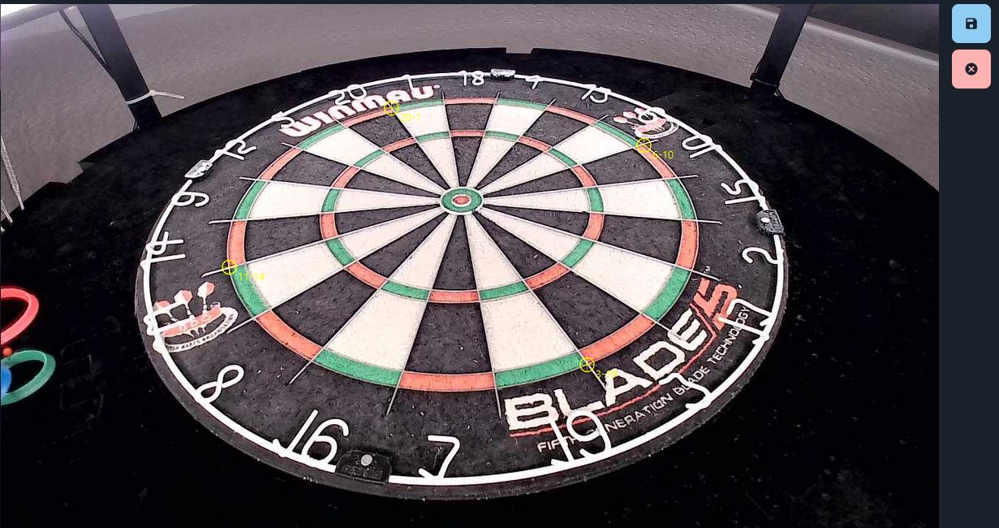

Due to many questions how to setup the cameras and the equipment I decided to write a quick tutorial.

## What is needed?

Of course if you want to start with autodarts.io you'll need a steel dartbaord. For a well working dart recognition you also need a 360 degrees led lightring so that the darts don't cast shadows. The cameras needs to have a good view on the baord. For that you need to find a way how the cameras can see the whole board. There are multiple ways to do that, for example attach them to the led ring. Because we want to caputre the darts you need three cameras. And last but not least you need a device where you can connect and control the cams. For that you can use a working computer with Linux running on it. You also can use a Rasbperry Pi 3B+ or better or an NVIDA Jetson Nano. Because the system is running on a Linux based system some Linux skills are nice to have. But I'm pretty shure people and a search engine can help you out here.

Also you'll need a an Autodarts.io account with a board id and API Key.

## Camera adjustments

This is one of the parts where the most questions are about but due to a very stable codebase the setup is quite easy if you stick to the following rules.

- The cameras need to have a good view on the whole board.
- The lenses of the cameras need to have an angle of 35 to 55 degrees to the board surface
- The cameras need to have a distance of 120 degrees to each other

Which camera you are using does not matter too much. But one of the things where you should take care of is that the camera does not have any distortion. My setup is running on cams which have a field of view (FOV) of 65 degrees and they are 30cm far from the wall and have a distance to the bullseye of about 36cm. This is a perspective of one of my cams.

## Linux system setup

Depends on which operating system or device you want to use the installation will differ. But what you need is to install the latest version of OpenCV on the machine. Here is a little tutorial for a Raspberry Pi ([Rasbperry Pi OpenCV installation guide](https://lindevs.com/install-precompiled-opencv-on-raspberry-pi/?fbclid=IwAR1sQwRH1FWbewNg4_Aomga-ZBbx3Di25C2mHrVqGTVxwiIKS31R0Pa8q5Y))

Of course you can almost use every linux based system. I personally using my Ubuntu 20.04 laptop. If you have similar setup you can have a look at this link ([Ubuntu 20.04 OpenCv installation guide])(https://vitux.com/opencv_ubuntu/)

Because you need to connect three webcams to your machine you should check if every cam is working correctly. As soon as you've done that you are ready to go.

### Get Autodarts running

To get the Autodarts program running you need to download the latest version auf Autodarts wich fits to your device. Please note that the version differs between Jetson Nano, Raspberry Pi or a desktop computer or laptop.

Once you have donwloaded the program you'll need to extract them with the the unzip command. After this is done you need to add execution rights to the autodarts tool.

    chmod +x autodarts

Now everything should be working and you can start the tool with the following command

    ./autodarts

## Board Manager

The board manager is to setup and adjust your cameras. Once you run your autodarts program on your Linux system you can access the Board Manager via the ip address of your device and the port 3180. If you're running the program on a local computer like a laptop you'll need to type this in your browsers url: http://127.0.0.1:3180 or if you're using a Raspberry Pi or the Jetson Nano than you need to replace 127.0.0.1 with your ip address of the device.

### Configuration

One you accessed the Board Manager you can click on Config in the top menue. There you can see the Auth section where you need to fill in the Board ID and the API Key which is needed to connect your Board to Autodarts. Also you need to change the USB Device IDs so that the tool will access the correct cameras. The best way to do this is with a little tool called v4l-utils. You can install this via the commandline on your machine. For that just type the following command in your commandline 

    sudo apt-get install v4l-utils

When the installation is finished you can use the following command to see all connected devices.

    v4l2-ctl --list-devices

Which shows the following on my device

    pi@raspberrypi:~ $ v4l2-ctl --list-devices
    bcm2835-codec-decode (platform:bcm2835-codec):
            /dev/video10
            /dev/video11
            /dev/video12
            /dev/video18
            /dev/media1

    bcm2835-isp (platform:bcm2835-isp):
            /dev/video13
            /dev/video14
            /dev/video15
            /dev/video16
            /dev/media0

    Aukey-PC-LM1E Camera: Aukey-PC- (usb-3f980000.usb-1.1.3):
            /dev/video7
            /dev/video8
            /dev/media4

    Aukey-PC-LM1E Camera: Aukey-PC- (usb-3f980000.usb-1.2):
            /dev/video1
            /dev/video3
            /dev/media2

    Aukey-PC-LM1E Camera: Aukey-PC- (usb-3f980000.usb-1.3):
            /dev/video5
            /dev/video6
            /dev/media3

    Cannot open device /dev/video0, exiting.
    pi@raspberrypi:~ $

In this example you can see that my cameras (Aukey-PC-LM1E Camera) were detected and are running. What you need to do now is to add the first video numbers into the USB Device Ids. For me it's 7, 1 and 5.

I'm using 1280x720 as resolution. You can put this to a lower resolution when your system is slow but in general it should be 1280x720. All the other settings can stay as they are.

### Calibration

After you did the configuration you can start with the calibration which is the part where it's good to be as much precise if you can because it effects the recogognized darts.

For the calibration you just need to drag the points (3-19, 6-10, 11-14, 20-1) to the upper double wire like you see in the picture.

When this is done for all three cameras you can click on the blue disk button on the right side. After you clicked the button you will see the segents edges overlayed to your board. If you did it very precise than the edges should match with your wires. If you propably bought cams with distortion. But even than the recognition is also working very well. Just give it a try :)

As soon as you are done you can start your board. You can do this either via the Motion, Dart, Config tab or on Autodarts.io after you're logged in. When you are on Autodarts.io you can create a game.

Game On!

## Working setups

### NullP0ints setup

Parts of the setup:

- Winmau Blade 5
- Winmau Plasma LED ring
- McDart Catchring Premium
- Aukey PC-LM1E Cams
- Raspberry 3B+

