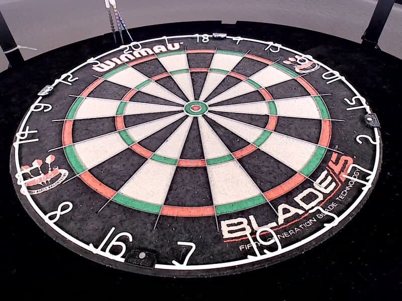
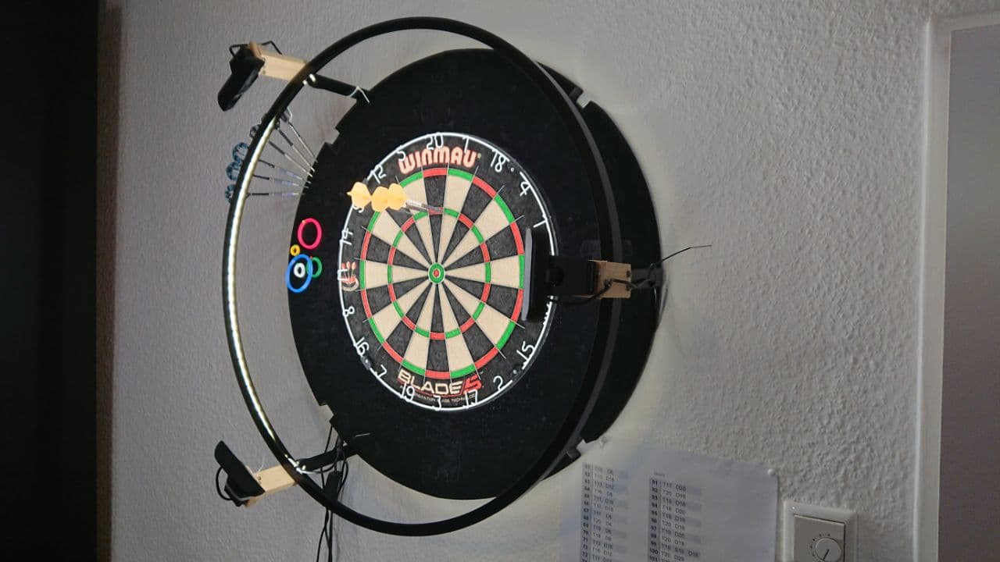
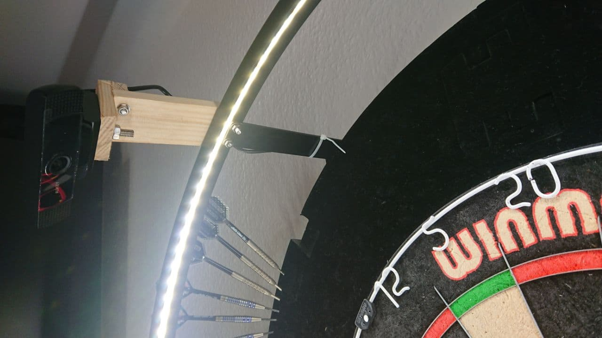
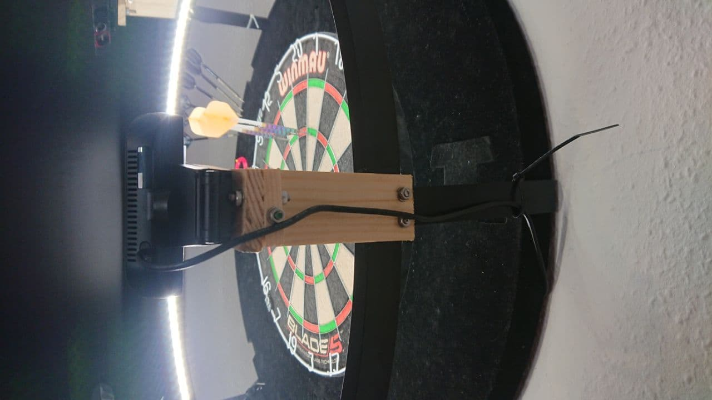

Due to many questions how to setup the cameras and the equipment I decided to write a quick tutorial.

## What is needed?

Of course if you want to start with autodarts.io you'll need a steel dartbaord. For a well working dart recognition you also need a 360 degrees led lightring so that the darts don't cast shadows. The cameras needs to have a good view on the baord. For that you need to find a way how the cameras can see the whole board. There are multiple ways to do that, for example attach them to the led ring. Because we want to caputre the darts you need three cameras. And last but not least you need a device where you can connect and control the cams. For that you can use a working computer with Linux running on it. You also can use a Rasbperry Pi 3B+ or better or an NVIDA Jetson Nano. Because the system is running on a Linux based system some Linux skills are nice to have. But I'm pretty shure people and a search engine can help you out here.

## Camera adjustments

This is one of the parts where the most questions are about but due to a very stable codebase the setup is quite easy if you stick to the following rules.

- The cameras need to have a good view on the whole board.
- The lenses of the cameras need to have an angle of 35 to 55 degrees to the board surface
- The cameras need to have a distance of 120 degrees to each other

Which camera you are using does not matter too much. But one of the things where you should take care of is that the camera does not have any distortion. My setup is running on cams which have a field of view (FOV) of 65 degrees and they are 30cm far from the wall and have a distance to the bullseye of about 36cm. This is a perspective of one of my cams.

## Linux system setup

Depends on which operating system or device you want to use the installation will differ. But what you need is to install the latest version of OpenCV on the machine. Here is a little tutorial for a Raspberry Pi ([Rasbperry Pi OpenCV installation guide](https://lindevs.com/install-precompiled-opencv-on-raspberry-pi/?fbclid=IwAR1sQwRH1FWbewNg4_Aomga-ZBbx3Di25C2mHrVqGTVxwiIKS31R0Pa8q5Y))

Of course you can almost use every linux based system. I personally using my Ubuntu 20.04 laptop. If you have similar setup you can have a look at this link ([Ubuntu 20.04 OpenCv installation guide])(https://vitux.com/opencv_ubuntu/)

Because you need to connect three webcams to your machine you should check if every cam is working correctly. As soon as you've done that you are ready to go.

## Working setups

### NullP0ints setup

Parts of the setup:

- Winmau Blade 5
- McDart Catchring Premium
- Aukey PC-LM1E Cams
- Ubuntu 20.04 laptop

