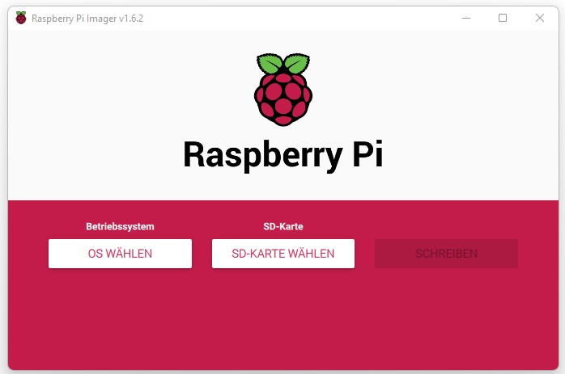

# Setup with RP4, using Raspbian with Desktop

This Manual should guide you through a setup using a Windows PC to prepare the Raspberry Pi Image and then successfully start autodarts
Let's a go!

## Needed:
### Physical
- Windows PC
- Raspberry Pi (4)
- SD Card
- Card Reader

### Virtual
- LAN, or WLAN connection
- Raspberry Pi Imager - [click to download](https://downloads.raspberrypi.org/imager/imager_latest.exe)

## Prepare SD Card:

- Put your SD Card in the Card Reader and connect it to your Windows PC
- Open Raspberry Pi Imager 
