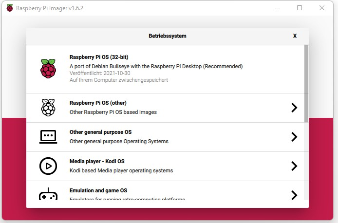
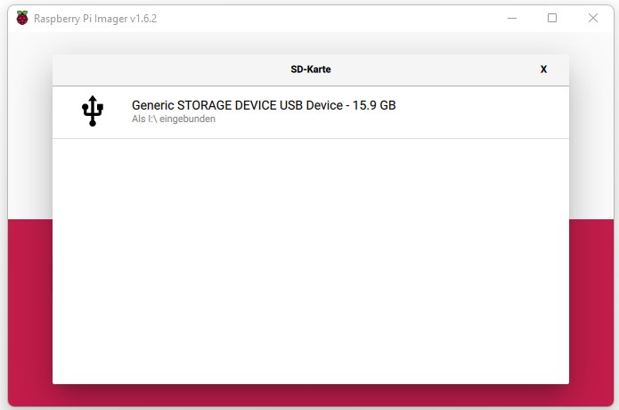
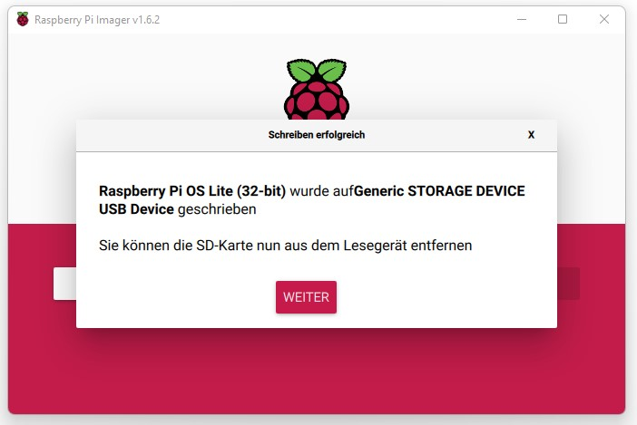
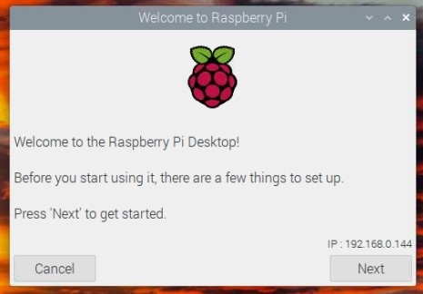
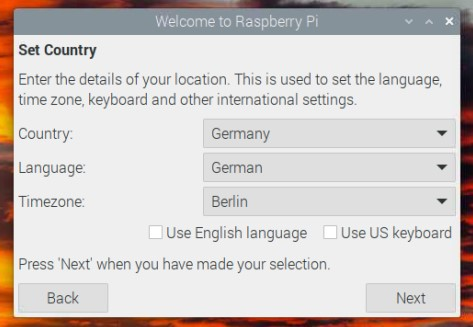
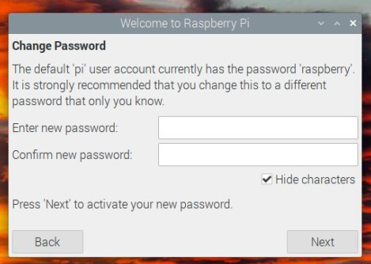
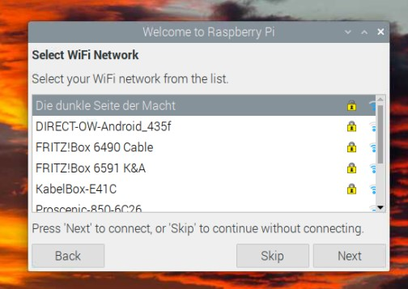
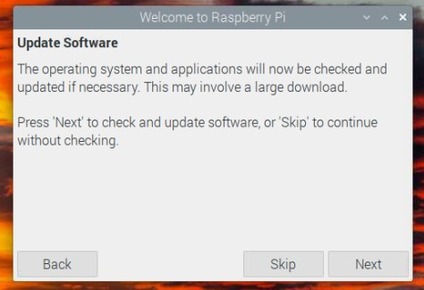

# Setup with RP4, using Raspbian with Desktop

This Manual should guide you through a setup using a Windows PC to prepare the Raspberry Pi Image and then successfully start autodarts.
Its a fairly simple manual and you have to connect a Monitor, Keyboard and Mouse to your Raspberry to properly set it up.But you can disconnect it from your PC and put it over to the Raspberry if you don't have a second set of theese, you won't need it at the same time.

*Let's a go!

## Needed:

### Physical
- Windows PC
- Raspberry Pi (4)  / *Monitor, Keyboard, Mouse
- SD Card
- Card Reader

### Virtual
- LAN, or WLAN connection
- Raspberry Pi Imager - [click to download](https://downloads.raspberrypi.org/imager/imager_latest.exe)
- VNC Viwer Win 32/64 - [click to download](https://www.realvnc.com/download/file/viewer.files/VNC-Viewer-6.21.1109-Windows.exe) | *optional*

## Prepare SD Card:

- Put your SD Card in the Card Reader and connect it to your Windows PC
- Open Raspberry Pi Imager

- Click on OS and select topmost option "Raspberry PI OS (32-bit)

- Click on SD-Card and select your SD-Card-Drive
- *for most of the time you only should see one drive to select*

- Hit write!

This takes about 5 minutes, depending on your SD-Card and Card-Reader and if finished should tell you to take out the SD-Card

- Now you can insert it to your Raspberry Pi and fire it up.

## Prepare Linux Desktop:

- When your Raspberry Pi has started its greeting you with a friendly Setup-Wizard

- Make your way through this wizard and select your Wifi-Connection. Updates are not Mandatory at this point, as it would take some time and is not needed.

  
 

- After finishing the Setup-Wizard its absolutely mandatory to enable SSH first. This will be your connection to your Windows PC
- For this click on the Raspberry-Menu and got to "Preferences -> Raspberry Pi Configuration"
- In the configuration Window go to the "Interfaces"-Tab and enable SSH and if you like VNC
  - VNC is a virtual Desktop environment to be used with Windows
